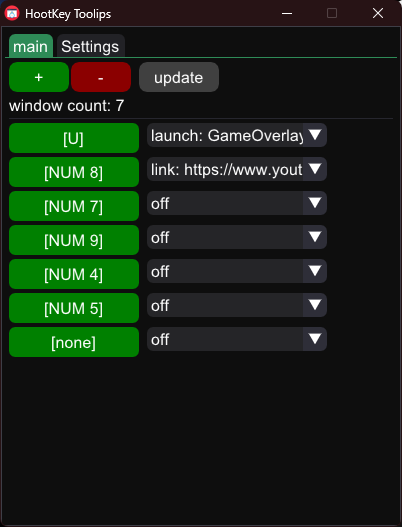
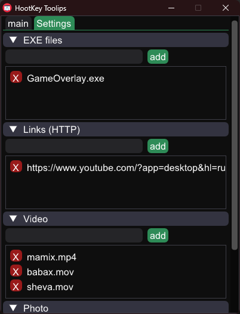

# ⌨️ HotkeyTools

A lightweight Windows desktop app for **global hotkeys**, **quick app/media launching**, and
**borderless fullscreen overlays** — built from scratch with C++17, Dear ImGui and the raw Windows API.

Originally written to mess with friends during screen shares (instant fullscreen images and videos),
it turned into a general-purpose hotkey launcher.


---

## 📸 Screenshots

| Main — hotkey bindings | Settings — sources |
| --- | --- |
|  |  |

---

## 🚀 Features

- **Global keybinds** — map any key to an action and trigger it from anywhere, using low-level
  polling via `GetAsyncKeyState`. Works even while another window has focus.
- **Media & app launcher** — instantly open URLs in the default browser, launch `.exe` files,
  or render images and videos.
- **Borderless fullscreen overlay** — images rendered with **GDI+**, videos with **MCI**,
  drawn borderless and always-on-top over every other window.
- **Drag & drop** — drop files straight onto the window; the tool parses them and copies them
  into its local media directory automatically.
- **Live rescan** — add files to the media folder and hit `update`; new media is picked up
  without restarting the app.
- **System tray** — minimizes to the tray instead of the taskbar. Right-click to restore or exit.
- **Auto-start** — optionally launches minimized together with Windows.

---

## 🛠 Tech stack

| | |
| --- | --- |
| **Language** | C++17 |
| **GUI** | Dear ImGui (GLFW + OpenGL2 backend) |
| **OS APIs** | WinAPI, GDI+, ShellAPI, winmm (MCI) |
| **Build** | CMake |
| **Config** | Plain local `.txt` files — no registry writes, no database |

---

## 📦 Installation (prebuilt binary)

1. Download `HotkeyTools.exe` from the [**Releases**](../../releases/latest) page.
2. Extract it to any folder.
3. Run `HotkeyTools.exe`.

**Requirements:** Windows 10 or 11. No installer, no runtime dependencies.

---

## ⚠️ Antivirus / SmartScreen warning

Your antivirus may flag this app, and Windows SmartScreen will warn you on first run. That is expected:

- the app polls the keyboard globally via `GetAsyncKeyState`, which looks like keylogger behavior
  to heuristic scanners;
- the binary is **unsigned** (code-signing certificates cost money);
- it can register itself for auto-start.

**No keystrokes are stored, logged or sent anywhere.** Only the keys you explicitly bind are checked,
and only to fire the action you configured. The full source is in this repository — if you would
rather not trust the binary, [build it yourself](#️-building-from-source).

Verify your download:

```powershell
Get-FileHash .\HotkeyTools.zip -Algorithm SHA256
```

Expected: `TODO_PASTE_SHA256_HERE`

---

## ⚙️ Building from source

```bash
git clone https://github.com/osFERPHY/hotkey-tools.git
cd hotkey-tools
cmake -S . -B build
cmake --build build --config Release
```

The executable is written to `build/Release/HotkeyTools.exe`.

### Dependencies

Dear ImGui and GLFW are vendored in the `imgui/` directory — no package
manager or extra setup required.

**Toolchain:** MinGW-w64 or MSVC with C++17 support.
```bash
vcpkg install glfw3 imgui[glfw-binding,opengl2-binding]
cmake -S . -B build -DCMAKE_TOOLCHAIN_FILE=<vcpkg>/scripts/buildsystems/vcpkg.cmake
```

**Toolchain:** MSVC (Visual Studio 2019+) or MinGW-w64 with C++17 support.

---

## 🗂 Files and configuration

```
HotkeyTools.exe
media/           # images and videos available to the launcher
config/          # .txt files holding bindings, exe list and URL list
```

Bindings, executables and links are stored as plain text, so they can be edited by hand
or backed up by copying the folder.

---

## 🔧 What I built myself

Being straightforward about this, since it comes up: some of the ImGui layout boilerplate was
AI-assisted. Everything that makes the app actually work was written and debugged by me:

- the global hotkey loop and key-state polling on top of `GetAsyncKeyState`;
- the borderless always-on-top overlay window, including GDI+ image rendering
  and MCI video playback;
- system tray integration, the context menu and minimize-to-tray behavior;
- drag & drop handling and the file parsing / copying logic;
- the auto-start mechanism;
- the config format and the CMake build.

---

## 🗺 Roadmap

- [ ] English / Ukrainian UI toggle (interface is currently Ukrainian)
- [ ] Modifier combos (`Ctrl` + `Shift` + key), not just single keys
- [ ] Per-binding hotkey conflict detection
- [ ] Replace polling with a `WH_KEYBOARD_LL` hook to cut idle CPU usage
- [ ] Adjustable overlay duration and position

---

## 📄 License

MIT — see [LICENSE](LICENSE).

---

## 🙃 Disclaimer

The overlay feature is meant for harmless fun with people who are in on the joke.
Don't use it on machines that aren't yours.
